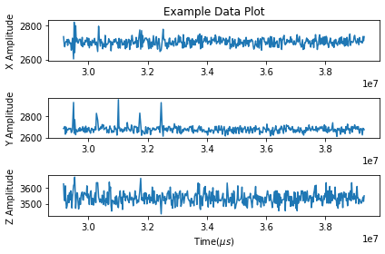
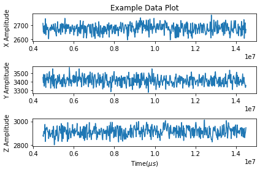
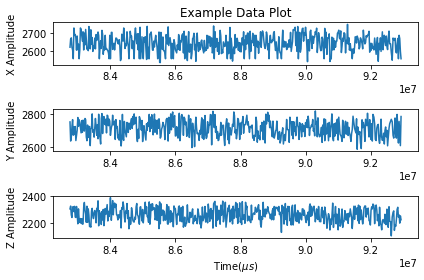

# Final Report
Dan Vu  
A14596430  

**LINK TO YOUTUBE DEMO:**  
## https://youtu.be/3ukGYTXiOgA

## Potential Failure Points

### Tap Issues

**Tap detection threshold**  

When trying to detect a tap when the accelerometer is NOT laying flat or being still, the tap detection does not always work as intended. For example, when the accelerometer is up-side-down, the current threshold values will not be able to detect when there is a tap because its "resting" values are no longer the same. Similarly, shaking or movement of the device may also register a tap, when there truly was no tap given. 

The X,Y,Z threshold values to detect a tap are not 100% accurate and reliable under different circumstances. This is because the current algorithm from lab 2 told us to determine the threshold values through repeated iterations of tapping and viewing the accelerometer readings and finally determining the threshold values through an estimate/average. These values are not 100% accurate because the CORRECT threshold value may vary with position & orientation of the accelerometer, movement, and even loose wiring (values of readings may change). In other words, the current algorithm from Lab 2 only works under the assumption that the accelerometer is laying flat and unmoved. 

*Potential Solution*  
A calibration period at start-up that runs for X-seconds that allows the MCU to collect and analyze the accelerometer readings and then self-determine the x-y-z threshold values for a current position. This will allow a dynamic designation of threshold values so that the tap detection can work for other positions rather than just laying flat. 

**Timer Count-down**

The timer countdown generally works as intended, but when looking at it through the perspective of the User Experience, it can be quite annoying when the timer increments too high (whether you accidentally tapped too many times or the MCU registered too many taps due to inaccurate threshold values) and you are stuck waiting until the timer hits 0 again before being able to do anything. Fixing the first issue with more accurate threshold values may reduce the likelihood of the MCU registering too many taps but the issue still holds if the user accidentally taps a few more times than intended.

The current algorithm has no built in way to decrement the timer and/or reset the timer back to 0 so that the user can try to input the correct time again. As of the current algorithm, when the number on the timer is > 0, and there has not been a tap detected for 3 seconds, only then will the timer start counting down. The only other way to reset the timer is to reset the entire MCU.

*Potential Solution*  
Using non-blocking logic or an interupt to detect another gesture/tap to interact with the timer even when the countdown is happening.

Another detectable gesture to interface with the MCU that is separate from "tap" so that we can have other potential options to interact with the timer. An example can be "shake" the device to reset the timer. Or perhaps an external button that will decrement/reset the timer.  

Note: If the first issue is also solved, meaning the tap threshold values are more accurate, it opens the possibility to have the user interact with the timer WHILE the timer is counting down. This functionality can be to pause/resume the timer or increment the timer while it is counting down (in case you still wanted to add time after not tapping for 3 seconds) You would need to use non-blocking logic to detect a tap while the timer is counting down. Also, the first issue must be first solved or else you may accidentally register a tap and interupt the timer without meaning to. 

**Limited functionality with accelerometer**

This issue is very similar to the potential solutions described in issue #2. When using the timer with the accelerometer I often asked myself why we are even using an accelerometer if the function is simply to add time to a timer. Such a simple function undermines the potential of what the accelerometer can actually do in terms of a gesture detection interfacing. Adding more functionalities and ways to detect different gestures can open up the possibility of implementing more features such as the shake-to-reset function described in issue #2. Furthermore, a function as simple as tapping to adjust a timer, is often more reliable and robust with a button, not an accelerometer. 

The way the device functions right now is as described above, just tap to adjust timer. 

*Potential features*   
Shake detection: perhaps to reset the timer
Activity detection: trigger heart-rate detection when it notices high activity
Idle dectection: possibly go into sleep-mode to save power?

Pretty much any gesture that can be detected will add more functionality to the device and will use more of the capabilities for the accelerometer. 

### HR Issues

**GMM randomly inverts the heart rate detection**

While iterating different scenarios and tests for Lab 5, I noticed that the GMM.predict will randomly "invert" the intended threshold detection for the HR signals. [insert visual plots to show]. This often affected the R/RMSE/Bias/Limits of Agreement (usually negatively) for the HR calculations. 

From my understanding, the GMM is a version of unsupervised learing and its function is to group data into "n-components'(in our case, n = 2) regardless of what the values are. For HR calculations, we want the GMM to capture when there is a heartbeat vs when there isnt a heartbeat and differentiate the 2 into 2 different groups. This does not mean that the GMM can automatically know which is Heartbeat vs Not-heartbeat, it just means the GMM can detect that they are DIFFERENT. 

This is an issue because the an inverted detection can often produce a less accurate HR calculation even though you are running the same code on the same sample. 

*Possible Solution*
The fix to this is pretty simple, you just need to add a hint of supervised learning to help the GMM revert the inverted prediction. 

**Having to retrain the GMM everytime the program runs**

Although the task to predict HR calculations based on GMM models is not complex, repeatedly needing to train the GMM everytime you want to test a new dataset or apply a new predict can become very time consuming, especially if you are training with a large dataset. 

The way the program runs right now is: Create the ML instance -> Train the GMM of the instance -> Test the GMM predictions. This works fine, except until the program terminates and the trained GMM also gets lost in the process. When you want to test a new dataset, it would be helpful to use the GMM you already trained instead of having to retrain it again. Being able to preserve the trained GMM can also be helpful if you want to train more data on it without having to start over or if you want to apply the GMM on a different device. 

*Possible Solution*  
There might already be a built-in solution if we just knew where and how the trained GMM is stored by Spyder. However, reviewing multiple sites and documentation, I still havent found a way  to preserve the trained GMM. A possible solution that can be implemented is having the program continuously run using a while loop and then interfacing with the program through the python console to test new datasets. This solution will only solve some of the issues, because when the program terminates, the GMM will also be lost. 

**Pressing too hard will give bad HR signal**

When measuring heartrate with the particle sensor, when applying too much pressure with your finger, the HR signal will get distorted and effect the HR calculation.
[instert graph]

With the current algorithm, there is no way to detect which signal is a bad signal and the HR will always try to calculate the HR regardless of the signal. This can result in poor estimations and potentially even a poorly trained GMM model. 

*Possible solution*
The algorithm should be able to detect when the HR data is bad and possibly request the user to re-gather the HR signal or handle the data itself. An exceptional solution for this would be difficult to implement but this is the idea. 

## Choosing the challenge(s)

Issue #1, The **Tap detection threshold**  issue, I believe is the most crucial issue to fix because it allows for the other issues to be handled with ease. An inaccurate threshold will not register the intended amount of taps ESPECIALLY when the accelerometer is in a position where it is not laying flat with the Z-value pointing up. In this challenge, I will attempt to implement the calibration algorithm so that the MCU can self-designate the threshold values based on the accelerometer readings while the device is starting up. As described earlier, this dynamic assigning of threshold values will allow the tap detection to work from any position as long as it is calibrated in that orientation. 

### Demonstration of failure
As of of the current algorithm, the tap detection code is as follows:

    int uthreshZ = 3667;
    int uthreshY = 2737;
    int uthreshX = 2799;

    bool detectTap(){
        readADC();
        bool tap_detected = false;
        if(accelZ_Val >= uthreshZ && accelY_Val >= uthreshY && accelX_Val >= uthreshX){
            tap_detected = true; 
        }
        return tap_detected;
    }

As we can see, I determined these thresholds by printing out the readings of the accelerometer while it was resting and using the highest values I found. However, these values will not translate to another scenario where the accelerometer is in a different position. 

**Here is a plot of me tapping 5x while the accelerometer is laying flat:**  
  
*The csv file for this plot is included in `Demo/doc/CSV/5taps`*

During this time, we can see that the taps are most clearly seen through the Y-axis. After a few more iterations I realized that this is because of the direction that my finger came from while tapping. Also, another note is that, although I tapped 5 times, it only registered 4 taps total. This is due to the inaccuracy of the threshold values and inability to detect different types of taps.

If we refer back to the code above, the current algorithm fails to detect one of the taps because perhaps the way I tapped did not allow one of the axis values to cross the predetermined threshold. 

Although this does generally get the job done, it puts a restriction on the user experience.

Also, while running tests to demonstrate this failure, there were also times that a tap was registered even though I did not tap or move the device. This is also due to the wrong threshold values. 

Further demonstrations of this error happens when you change the orientation of the accelerometer. The current algorithm works ONLY if the device is laying flat with the +Z-axis pointing up. When we change the orientation of the accelerometer, the "resting" values captured will also change accordingly. 

As we see in the plot above, the "resting" value of the Z-axis hovers between 3500 and 3600. And the "resting" value of the Y-axis hovers near 2600. We will pay attention to the resting values of these axes as I change the orientation of the accelerometer.

**+Y-axis pointing up AKA accelerometer is on its side**  
 

**-Z-axis pointing up AKA accelerometer is upside-down** 
 

Notice now that the resting values in these 2 plots have changed. From my observations and verification with the accelerometers documentation, I concluded that the accelerometer readings also detect orientation of the device. In the plot with the accelerometer on its side, the +Y-axis was pointing up, thus the Y-axis value changed to hover 3400 (from 2600). When the accelerometer was upside-down, the -Z-axis was pointing which would imply that the Z-axis value should decrease 3500ish to 2300ish. 

It is clear that with the change in orientation of the device, the threshold values must also change or else the algorithm will not be able to detect that taps (since the threshold values have changed in accordance to orientation).

## Implement the Solution

Solution: Create a calibration period at startup where the user can not touch the device so that it can calibrate and assign threshold values based on the accelerometer's current orientation. 

My plan for this implementation is to have a calibration method called in setup() that will run for 10 seconds. During these 10 seconds, the user is prompted "DO NOT MOVE THE ACCELEROMETER" through the OLED. After it displays this message, the MCU will begin recording accelerometer values and saving the LOWEST and HIGHEST values of the "resting" state. These values will then be saved as the upper and lower thresholds. 

I chose to use this algorithm because it will be able to dynamically store the proper threshold values depending on the orientation of the accelerometer, meaning the tap detection will not be limited to the device laying flat.

**CODE FOR CALIBRATION**

    void calibrate(){
    showMessage("Calibrating...", 1, true);
    showMessage("Don't move", 2, false);
    
    int maxZ = analogRead(accelZ);
    int minZ = analogRead(accelZ);
    int maxY = analogRead(accelY);
    int minY = analogRead(accelY);
    int maxX = analogRead(accelX);
    int minX = analogRead(accelX);
    
    while(t < 10000){
        accelZ_Val = analogRead(accelZ);
        accelY_Val = analogRead(accelY);
        accelX_Val = analogRead(accelX);
        
        if(accelZ_Val > maxZ){
        maxZ=accelZ_Val;
        }
        if(accelZ_Val < minZ){
        minZ=accelZ_Val;
        }
        if(accelY_Val > maxY){
        maxY=accelY_Val;
        }
        if(accelY_Val < minY){
        minY=accelY_Val;
        }
    
        if(accelX_Val > maxX){
        maxX=accelX_Val;
        }
        if(accelZ_Val < minX){
        minX=accelX_Val;
        }
        t = millis();
    }
    
        showMessage("Calibration Complete!", 1, true);
        showMessage("Tap to start", 1, true);
        Serial.print("Lower threshold for Z:");
        Serial.print(minZ);
        Serial.print(" ");
        Serial.print("Upper threshold for Z:");
        Serial.println(maxZ);
        Serial.print("Lower threshold for Y:");
        Serial.print(minY);
        Serial.print(" ");
        Serial.print("Upper threshold for Y:");
        Serial.println(maxY);
        Serial.print("Lower threshold for X:");
        Serial.print(minX);
        Serial.print(" ");
        Serial.print("Upper threshold for X:");
        Serial.println(maxX);
    
        uthreshZ = maxZ;
        lthreshZ = minZ;
    
        uthreshY = maxY;
        lthreshY = minY;
    
        uthreshX = maxX;
        lthreshX = minX;
    }

**PROOF IT WORKS**

 

In the gif above, we see that initially, the taps are not detected. This is because the threshold values have not been correctly calibrated to that orientation (-X axis pointing up). Once I reset the MCU and let the program calibrate (for 10 seconds) to that orientation, we can see that the tap detection now works correctly. For the sake of brevity, I will only show this orientation, we can explore more tests in the DEMO video. 

**Note:** Limitations  
 This implementation does solve the problem with being able to detect the tap from different orientations. However, there are still limitations to this solution. My implementation currently, does not allow for a change in orientation AFTER calibration has completed. You would have to reset the MCU to re-calibrate in the new orientation. An IDEAL solution would be to assign the correct thresholds for any orientation without having to reset the MCU and re-calibrate. This can possibly be accomplished by machine learning and data analysis to see numerically/mathematically how the threshold values would change as the the orientation changes. An equation to change the threshold values can be determined through this. 
 *My current solution may act as a starting point to implement this.*

## Going Further (Extra)

Upon implementing this solution, I also realized that having a calibration and more accurate thresholds opened the doors to solve issues #2 and #3 as well. In this next part, I challenge myself to implement 2 more solutions: 
1. Shake detection 
2. Non blocking interupt to interface with timer during the count down

Together, these solutions will be combined to implement a Shake-to-reset-timer function. As described earlier, this issue needs fixing because it will improve user experience and utilize the potential of the accelerometer. The current algorithm does not allow anything to be done while the timer is ticking down, this solution will allow you to shake the device to reset the timer back to 0. 

### 1. Shake Detection
Shake detection would be similar to the tap detection algorithm where we determined if there was a tap or not when the accelerometer readings were above/below a certain threshold. Anything within that threshold would be known as the "resting" state, and anything that passes the thresholds would be a tap. 

However, this time, a shake is pretty much a more intense tap that occurs more frequently. We just need to determine another upper and lower threshold value that will be passed only when there is a shake and NOT when there is a tap. 

I determine these new threshold values by shaking the device to see how high/low the accelerometer values go when shaking and emperically determine which values work the best. 

Values:  

    int usthreshZ = 4000;
    int usthreshY = 3000;
    int usthreshX = 2900;

    int lsthreshZ = 2550;
    int lsthreshY = 2050;
    int lsthreshX = 1800;   

**Note:** Limitation  
I did not want to over complicate this solution for the sake of time so this shake detection will work best when the accelerometer is facing up. AKA the +Z axis is pointing up. In order to have it work in other orientations, a similar algorithm from the solution to issue #1 can be implemented to dynamically allocate these thresholds as well. However, in this challenge, I will not implement this.

After determining the proper thresholds for shake detection, I then modify the function detectTap() to detectGesture() and give it the functionality of detecting both a tap and a shake. Also, since we are not detecting more than 2 states, I also change the return value of the function from `bool --> to int`. The function will return an integer restricted to 3 values: 0 - no tap, 1 - tap detected, 2 - shake detected. 

**Code:**

    int detectGesture(){
        readADC();
        int gest_detected = 0;
        if(accelZ_Val >= uthreshZ && accelY_Val >= uthreshY && accelX_Val >= uthreshX){
            if(accelZ_Val >= usthreshZ || accelY_Val >= usthreshY || accelX_Val >= usthreshX){
                Serial.println("shake detected upper");  
                printADC();
                gest_detected = 2;
                return gest_detected;
            }
            gest_detected = 1; 
        }
        else if(accelZ_Val <= lthreshZ && accelY_Val <= lthreshY && accelX_Val <= lthreshX){
            if(accelZ_Val <= lsthreshZ || accelY_Val <= lsthreshY || accelX_Val <= lsthreshX){
                Serial.println("shake detected lower");  
                printADC();
                gest_detected = 2;
                return gest_detected;
            }
            gest_detected = 1;
        }
        return gest_detected;
    }

**Proof Shake Detection Works**  
 

From the code, I have the MCU print out "shake detected" along with the ADC values whenever a shake is detected. In the gif shown, you can see that when I try to tap, nothing is printed even though the timer is incremented (hard to see in gif, I can demonstrate it better in DEMO video). However, when I shake the device, it prints out shake detected as prompted. This shows that the device can detect and differentiate shakes and taps.

**Note:** Limitation 
Since the nature of shakes are less consistent than taps, this also brings up a few issues such as the "starts" or "ends" of shakes can be detected as a tap instead. However, in this challenge I do not tackle these issues and just focus on the issues listed earlier. Depending on the scale of overall product, it may be important to fix this properly, but for the purposes of this grand challenge, I will handle this limitation with a few hacky software tricks that will be further explained in the next solution. 

### 2.  Non blocking interupt to interface with timer during the count down

This solution will build off of the previous solution as I will attempt to use the Shake detection to implement a Shake-to-reset-timer feature. There are different ways to do this feature but the one I will implement will have the following restriction:
`Shake-to-reset will only work DURING the timer's countdown period. This is because I specifically want to solve the issue of creating an non blocking interrupt for the countdown`. 

The hacky software tricks to handle the limitation described above is to simply have the MCU handle ONLY shake-detection while the timer is counting down. This hacky trick may make the overall product less scalable because it limits a possible feature of tapping during the countdown period. This possible feature can perhaps be a tap-to-pause-timer feature. 

The other hacky trick I used is a 5-second delay between the OLED displaying "Timer Resetting" and actually resetting the timer. This gives the user an illusion that it takes some time for the timer to reset, but the main reason I did this is to prevent the timer from instantly resetting while the user is still shaking and possibly reset multiple times and/or accidentally add to the timer. 

**Now that I explained these tricks I used to solve this issue, here is the actual implementation code:**

I modified runTimerOLED() from decrementing the timer each second using a delay(1000) to now using non-blocking logic to allow me to check for a tap during this time. When the shake is detected, I have a global variable boolean called `reset` that will become true. Right after that, I exit the function before the while loop iterates again by returning a `void`. 

**Code:**

    void runTimerOLED(){
        unsigned long before = millis();
        while(timer_seconds > 0){
            unsigned long now = millis();
            if(now - before >= 1000){
            timer_seconds--;
            char message_buffer[4];
            String stringTime = String(timer_seconds); //convert timer_seconds to string
            stringTime.toCharArray(message_buffer,4); //convert string to char buffer
            showMessage(message_buffer, 1, true);
            before=now;
            }
            else if (detectGesture()==2){
            reset = true;
            return;
            }
        }
    }

Next, I also change my stateMachineTimer() function to handle this new update. The change is quite simple, if the boolean reset is true, then the timer will reset and the timer_state will change to `0`. Else, the timer_state will continue to state `3`, aka there was no shake detected and the countdown reaches 0. 

**Code:**

    else if (timer_state == 2){
        runTimerOLED();
        if(reset){
        showMessage("RESETTING TIMER", 1, true);
        delay(5000);
        showMessage("Tap to start", 1, true);
        timer_seconds = 0;
        reset = false;
        timer_state = 0;
        }
        else{
        timer_state = 3;
        }
    } 

Since the proof of concept for this solution is very similar to my DEMO video, I will omit displaying it here as a gif. 

**LINK TO YOUTUBE DEMO:**  
## https://youtu.be/3ukGYTXiOgA

# END OF FINAL REPORT