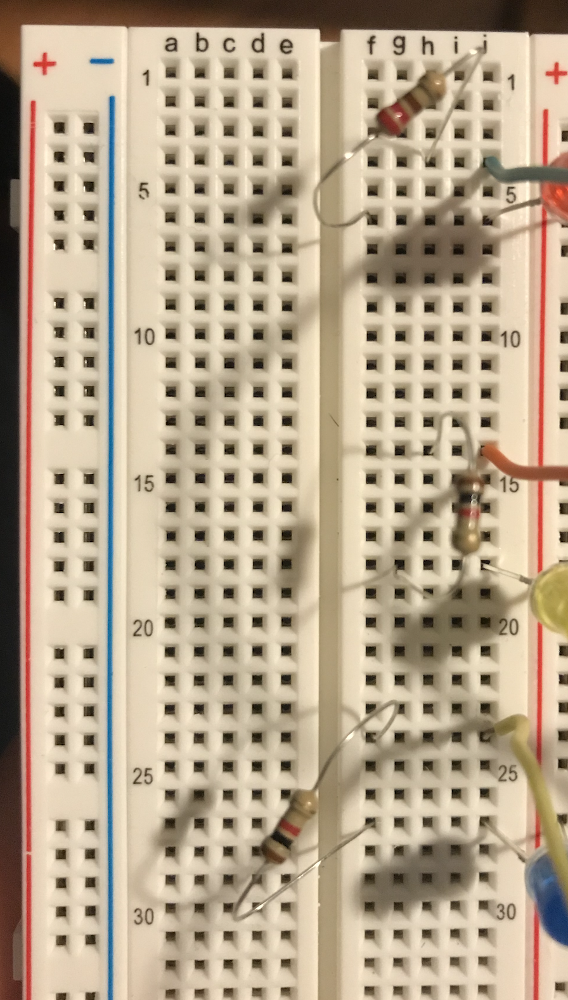
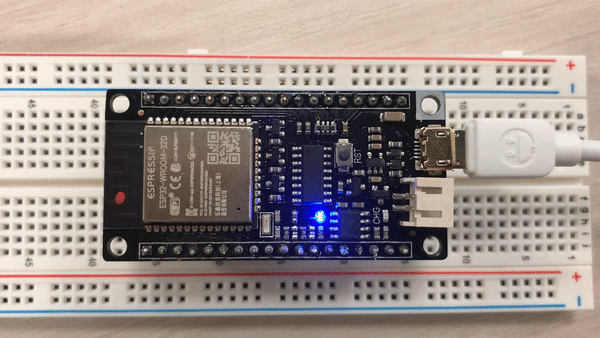
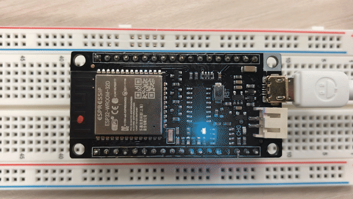
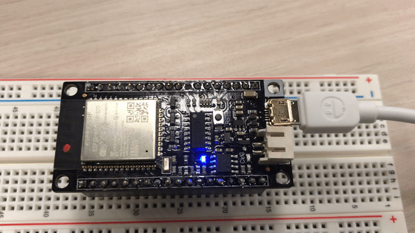
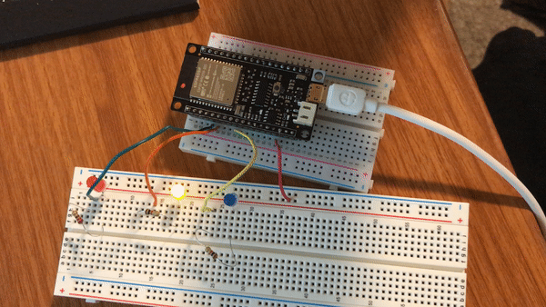
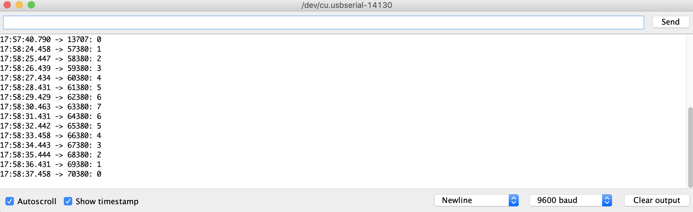

# ECE16 LAB 1 REPORT
Dan Vu
A14596430

Date: 01/15/2020

## Tutorial:

### Tutorial 1:

> Q1. What is the frequency of the blink rate in this example? Note that frequency is the inverse of the time it takes for a cycle. A cycle is the time it takes to go HIGH to LOW to HIGH again. Record a video of your FireBeetle blinking.  Make a note of the answer for now, in the next GIT tutorial, you will get a copy of a sample lab report.

> A1. Light is ON for 500ms and then OFF for 1000ms, meaning the period is 1500ms. Therefore the frequency is 2/3 hz.

> Q2. When you open the conflicted readme, what did you get? How did you fix it?

> A2. There were conflict markers <<<<<<<, =======, >>>>>>> that indicated the merged conflicts. I reviewed the conflicts, fixed them,  and deleted the markers by hand.

### Tutorial 2:

> Q3. Why do we need a pull-up resistor? Describe the behavior without it.

> A3. The pull-up resistor "pulls up" the input voltage to remove possible noise that may interfere with the input. Without the pull up resistor, the "open" button will be affected by noise and the LED turns on and off randomly. 

> Q4. Which GPIO pin did you have to use according to the above setup?

> A4. According to the set up, I had to use GPIO IO26. This can be checked from the datasheet or diagram provided earlier in the lab.

> Q5. What is the expected current draw?

> A5. Since the voltage drop of a red LED is 2.2V, and the source voltage is 3.3V, and the resistor is 220 Ohms. The expected current draw will be 5 mA. 
I = (Vsource - VLed)/Resistor

> Q6. What is the limit for the GPIO? You can find this on the ESP32_WROOM datasheet: https://www.espressif.com/sites/default/files/documentation/esp32-wroom-32_datasheet_en.pdf . Look under IOH.

> A6. The maximum output current for the GPIO is 1,100 mA.

> Q7. In your report, run the above code at Baud Rate of 9600. How many seconds are between each Hello World? What did you expect the time between each print statement to be and what did you actually get?

> A7. At a baud rate of 9600, I have a random and clumped time outputs for each hello world line. I expected around 15 milliseconds in between each message because each line was 14 characters long with each character being 8 bits. 

> Q8. How does this change when you change the baud rate to 2400, 4800, and 115200. (When you change the baud rate, you’ll also need to change the Serial Monitor’s Baud Rate. The answer to this question should be quantitative and not just qualitative.  Remember that baud rate refers to how many bytes per second is sent. Remember that an ASCII character is 8 bits.

> A8. A lower baud rate outputs messages at a lower rate, while a higher baud rate outputs at a higher rate. The actual quantitative value from the serial monitor and its time stamps are not constant. 

## Challenges:

### Challenge 1: LED blink frequency

This challenge is about using the MCU to adjust the frequencies at which different LED lights blink. I approached this challenge by first building the circuit to connect the red, yellow, and blue LEDs to the corresponding pins. Next, I write the code that adjusts the blinking frequencies for each condition. Knowing that 1hz = 1/1000ms helped implement the right frequencies. 

>Q. What are the resistor values you chose for each of the LEDs?

>A. I chose a 1000 ohm for the red led, and 220 ohms for yellow and blue leds. The resistors help control the current draw to the leds so that it does not burn out. The output voltage is 5V for the pins and each LED.
>
>To include an image, first include your image in your images folder. 
>

>Q. Videos showing each condition (please record in landscape-horizontal mode)

>
>
>
>
>
>

### Challenge 2:
> Q. What is the average time elapsed for each second increment? Use millis() to help you with this task. Describe how you measured this. 

> A. I wrote my code using the millis() function to display the time(in ms) since the program has started and then corresponded that time to each time the timer was counting. The average time elapsed for each second is about 1000ms or  1 second which is expected.
>

### Challenge 3:
> Q. Describe in plain english the logic of your program. 

> A. My program first uses a function to check if the button has been pressed or not. Note that the boolean logic is inverted because I am using a pull-up resistor. The program will check if the button is pressed, if it is pressed then the program will start the timer which will +1 every second. This is printed into the serial monitor along with the millis() function to check the time between each count. If the timer count is any integer above 0 AND the button is not pressed, the program will start counting down (-1) every 100ms and likewise print out the change onto the serial monitor. 