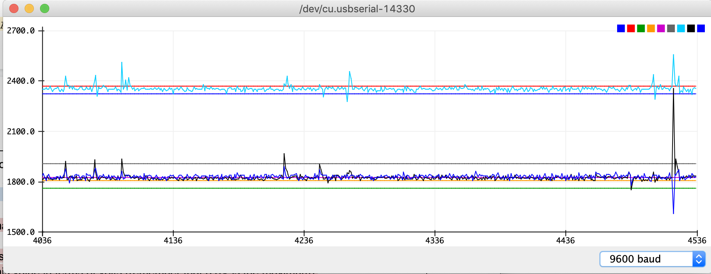
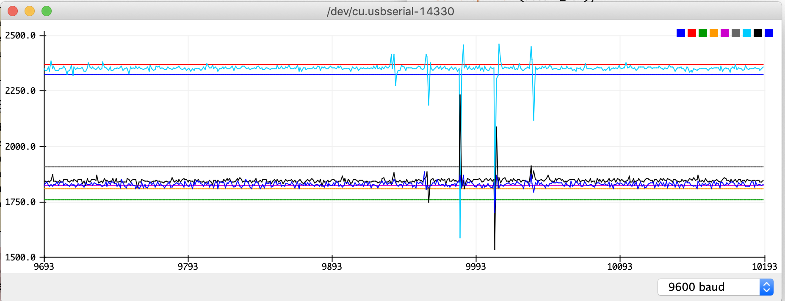

# ECE16 LAB 2 REPORT
Dan Vu
A14596430

Date: 01/29/2020

## Tutorial:

### Accelerometer:

> Q1. How many bits is your ADC? Try connecting your A0 pin to 3.3V. How did you calculate the bits?

> A1. The ADC has 12-bit precision. When connecting the A0 pin to 3v3, we get the maximum voltage that ADC can receive; in this case it is 4095. To calculate the number of bits we solve for N in [2^N = 4096]. N = 12.

> Q2. What is the resting value of the accelerometer when it is laying face up. Why is it not 0? What is this value in terms of volts (remember that 3.3V is the maximum).

> A2. The resting value of the accelerometer is about 2300. The resting value is not 0 because an accelerometer needs to be able to detect the direction of the movement which can be either positive(up) or negative(down). Since, the minimum output voltage of the ADC is already 0, the values can NOT be negative. This value 2300 in terms of volts is about 1.85V. 

>Q3. Tap the accelerometer light, medium, and hard. What is the average value of each tap? How did you calculate this? Please don’t ask us if you are tapping correctly, use your judgement :) Show a screenshot of the accelerometer plotting and tapping at different strengths.

>A3.  First 3 spikes are light(z=2496avg), next 3 are medium(z=2488avg), and last is hard(z=2560). The light blue signal is the Z - axis. I calculated the avg by tapping a few times and getting those values, adding them up, and then dividing by the number of taps.

### Pulse Width Modulation:

> Q4. In the above figure, assuming we are showing 2ms of data, what is the PWM frequency?

> A4. The frequency of the PWM is 2500. There are 5 pulses in 2ms which translates to 5000 pulses in 1 second.

> Q5. Why is 100% duty cycle 255 instead of 256?

> A5. With 8-bits of resolution, there are 256 steps of resolution but the first step starts at 0. Therefore the highest step of resolution would be 255.

> Q6. We purposely made some mistakes in the above example.  What were they? It will not work directly, but by reading the compilation error, the tutorial instructions, and comments carefully, you should have no trouble getting it to work!

> A6. The global variable pwmBitResolution did not have the "R" capitalized at declaration so it wasn't recognized as an arguemnt in ledcsetup function. The delay(100) function calls also lacked semi-colons. ledcAttachPin in the loop function should be replaced with ledcWrite.

### OLED:

> Q7. Again we made some intentional mistakes in the code above. What were they?

>A7. The defined function was showMessage, not showMessages. Missing semi-colon. Argument name is message, not messages. 

### Serial Read:

>Q8. What did the Arduino receive? How does this change if you use different line endings?

> A8. The arduino receives the byte value that corresponds to an ASCII code for each character. It also receives a newline byte value and carriage return byte value. Changing different line endings can include and/or omit the newline and/or carriage return values.

>Q9. What are the Decimal values of NL (new line) and CR (Carriage Return)?

>A9. Newline value = 10, Carriage return value = 13.

## Challenges:

## PART 1 

### Challenge 1: Fading Buzzer

>Q. Which pin does the code ask you to use for the motor?

>A. Pin 5 (IO5/D8)

>Q. Why can’t we achieve this speed variation using a digitalWrite and instead has to use ledcWrite?

>A. With digital write we can only tell the buzzer to buzz(at max speed) or not buzz at all. ledcWrite uses PWM to imitate an analog signal which allows us to variate the speed.

### Challenge 2: Gester Detection

>Q. What are some different logics you tried and why? What are some situations where you noticed your detection algorithm doesn’t work well?

>A. I tried to collect data from all 3 axis of the accelerometer in a separate arduino project to find the Min and Max values of each axis. From there, I adjusted the upper and lower threshold values accordingly to try to detect when it is resting and when there is a tap. I did this to create a resting threshold for the accelerometer, and if the readings exceed that then there would be a tap. The orientation of the accelerometer has to be relatively unmoved and the tapping shouldn't be too soft or it wont detect correctly. 

>A.2 (edit) My next logical solution was to create a calibration function that runs for 10 seconds before the rest of the program starts. During this time, you should not move the accelerometer because it is currently setting the threshold boundaries for each axis. Doing this allows for the tap detection to be more accurate in any orientation of the sensor.

>Q. Provide a screenshot of a plot showing 5 taps and the threshold used. 

>A. . Light blue = Z. Black = Y. Dark blue = X. All other lines are their threshold values accordingly. 

>Q. Include a video of you tapping on the accelerometer and the OLED counting each time. 

>A. 

### Challenge 3: Read and write to OLED

>Q. Video of a message typed into the serial monitor and appearing on the OLED. This video should be shot WITHOUT moving the camera. 

>A. 

>Q. What happens if you write a really long message? Why?

>A. When a message is too long, the text wraps around but remains on the same line. This causes it to replace the characters already present in those positions. This happens because when the cursor reaches the end of the OLED, it jumps back to position 0 but doesnt not start a new line.

## PART 2

### Challenge 4: Non-blocking logic

>Q. As a thought exercise, how might you implement this using BLOCKING logic? 

>A.  It would be difficult to come up with a way to make the timer wait 3 seconds after the last tap to start ticking down. Another way to solve this with blocking logic can be to have another 

>Q. How would you use NON-BLOCKING logic to set the sampling rate of the accelerometer to 50Hz? Write a pseudo code.

>A (start)↓
- end = millis(); start = 0;
- period = 20; // 20ms == 50hz
- if (end - start >= period){ 
- value = analogRead(pin#)
- start = end;}
>A (end)↑

### Challenge 5: State Machine of the Watch

>Q. How many states do you need? Describe in words what each state does and it’s transition logic. Draw the state machine

>A. The first state, timer_seconds should be 0 and the watch is waiting for the first tap. When a tap is detected, timer_seconds is incremented once and the machine goes to the second state. At the second state, it constantly checks time_now - time_last_tap  >= 3 seconds. If during these 3 seconds a tap is detected, time_last_tap is reset to millis() and it remains at the 2nd state. If 3 seconds pass, it goes onto the 3rd state where the clock starts to count down each second. It remains at this state until timer_seconds is decremented all the way back to 0. When it reaches 0, the watch goes back to the first state.

### Challenge 6: Gesture Controlled Watch

>Q. Video Demonstrating tap + timer function on OLED. Tap the device 10 times and have it count down, have the motor buzz, and then tap to deactivate. Have the motor floating in the air so that when it vibrates, you can see it move.  This video should be shot WITHOUT moving the camera.

>A. 