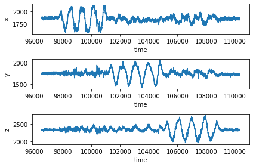
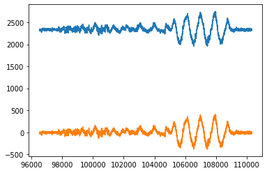
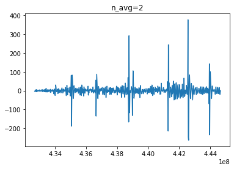
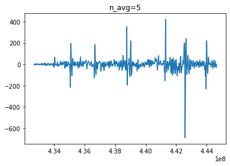
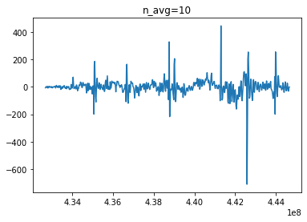
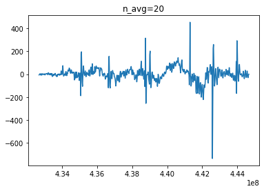
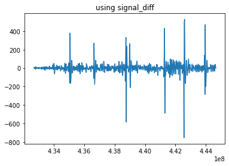
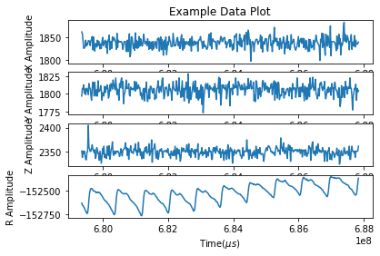
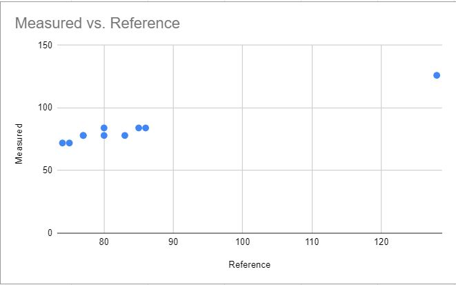

# ECE 16 LAB 4 REPORT
Dan Vu  
A14596430

2/24/2020
- - -
## Tutorials:

### MAX30105 Pulse Sensor:
> Q1. Note that you can connect both the heart rate sensor and your OLED at the same time, both of which use the I2C SDA and SCL lines. Why does this work?

> A1. The I2C protocol allows the "master" (MCU) to connect with multiple "slave" devices- in this case, the 2 "slave" devices are the OLED and the heart rate sensor. This works because the OLED and the heart-rate sensor have unique addresses that are sent (in the first data frame) and allow the MCU to select which device is going sending or receiving data. Setting and selecting the device addresses are configured by the MCU through the Wire.h library.

> Q2. Notice the while(1) statement. What happens if the device is not connected? What happens if the error is printed and then you connect the device? Will the code proceed? Try it and describe the behavior.

> A2. If the device is not connected, an error message " MAX30105 was not found. Please check wiring/power. " is printed into the serial monitor. If you connect the device after the error is printed, the code will not continue to proceed because it can not exit the while(1) loop. To proceed you must reset the MCU and make sure the sensor is connected.

> Q3. what would the settings look like if you were to: set the led brightness to 25mA, use only the Red + IR LED, Sample at 200Hz, and use an ADC range of 8192?

> A3. 
>
>     byte ledBrightness = 0x80; //Options: 0=Off to 255=50mA
>     byte sampleAverage = 8; //Options: 1, 2, 4, 8, 16, 32
>     byte ledMode = 2; //Options: 1 = Red only, 2 = Red + IR, 3 = Red + IR + Green
>     int sampleRate = 200; //Options: 50, 100, 200, 400, 800, 1000, 1600, 3200
>     int pulseWidth = 411; //Options: 69, 118, 215, 411
>     int adcRange = 8192; //Options: 2048, 4096, 8192, 16384

> Q4. What are the units of the pulse width? Would the bigger the pulseWidth result in a more intense or less intense measurement? Why?

> A4. According to the data sheet, the pulseWidth units are in micro-seconds. It seems like a higher pulseWidth results in a less intense measurement (measured amplitude). 

> Q5. How many bits are needed for an ADC range of 16384?

> A5. 2^14 = 16384, therefore 14 bits are needed for an ADC range of 16384

> Q6. What is the peak wavelength of the R, IR, and G LEDs?

> A6. According to the datasheet, the typical peak wavelengths for each LEDs are:  
> Red:660nm, IR: 880nm, Green: 537nm. 

> Q7. If you want to read the Green value, what Mode do you need the setting to be in and what function will you need to use to get the green signal?

> A7. LED MODE needs to be 3, and you will call the `.getGreen()` function.

### Matplotlib:

> Q8. What was plotted? What does this tell you about how plt.plot interprets the input? Remember that
>
>     a = [1, 2, 3, 4]
>         [1, 4, 9,16]

>A8. plt.plot interprets the input array as multiple data sets of y-values. Each column is a separate data set and is plotted separately with a different color. This is different from plotting `plt.plot([1,2,3,4],[1,4,9,16])` because it only takes 1 argument (np.array a). If there is only 1 argument, plt.plot interprets the dataset as y-values and determines the x-values automatically as an index array 0..N-1, where N is row#.  
> PLOT: `plt.plot(a)`  
> 

> Q9. Try your best to replicate the above plot by shaking your accelerometer. The above was sampled at 50Hz for 10 seconds. Make a gif of you running your program, shaking your accelerometer, and a plot showing up similar to the one above

> A9.  
> 

> Q10. What is approximately the frequency of oscillation of the x axis signal in the plot above?

> A10. The x-axis graph performs 1 oscilliation period in about 0.0005e9 microseconds which is about .5 seconds. Therefore, the frequency of oscillation is about 1/0.5 or 2 hertz. 

### Filtering Signals
#### Removing mean offset
    s = data_array_saved[:,3] #get the z 
    mean_s = np.average(s)
    s = s-mean_s
    plt.plot(time,s)
    plt.show()
> Plot:   
> 
#### Smoothing with moving average
    def moving_average(s,n_avg):
        ma = np.zeros(s.size) 
        for i in np.arange(0,len(s)):
            ma[i] =  np.average(s[i:i+n_avg])   #mean of s from index i to i+n_avg
        return ma

    if __name__== "__main__":
        plt.clf()
        plt.plot(time,moving_average(s,2))
        plt.show()
#### Detrending a moving average

    def moving_average(s,n_avg):
    ma = np.zeros(s.size) 
    for i in np.arange(0,len(s)):
      ma[i] =  np.average(s[i:i+n_avg])   #mean of s from index i to i+n_avg
    return ma

> Q11. Try different n_avg and document, with plots, the result for a few different n_avg and describe which n_avg worked well in emphasizing the taps? 

> A11.  A lower n_avg (greater than 1) seemed work the best for emphasizing the taps. A higher n_avg sometimes did not fully detrend the movement of the accelerometer. 
> 
> 
>
> 

#### Looking at the signal in different ways
> Q12. Try using np.diff(s) to calculate the gradient of the signal s and plot the signal. 

> A12. 

## Challenges:

### Challenge 1:
> Q. Why do we plot the negative of the signal? This has to do with light absorption. We talked about it in class.

> A. We plot the negative of the signal because the sensor reads light absorbtion. When there is a heart pulse, more blood is present at the fingertip therefore less light is measured. 

> Q. Try different sampleAverage parameters and plot them. What is the effect of sampleAverage on the smoothness of the signal?

>A. A higher sampling average seems to result in a smoother signal when measuring heart pulses. A lower sampling average had a signal with more noise  
>  
> Sampling average = 1  
  
> Sampling average = 8  
>   
> Sampling average = 32  
  

> Q. Try different ledBrightness. Is brighter always better? Why or why not

> A brighter led is not always better. When the ledBrightness is too high, the signal measured becomes a constant signal and is not helpful.   
> Plot:  
>ledBrightness = 31 (0x1F)  
>    
>ledBrightness = 15 (0x0F)   
>     
> ledBrightness = 128 (0x80)   
  
> ledBrightness = 255 (0xFF)  
>

>Deliverable: Tune the settings so that you ultimately get a sampling rate of 50Hz. What setting did you land on that gave you a clean signal and at the right sampling rate? Show a gif of you starting your code, and end with the plot appearing. Also include a still image of the plot

    byte ledBrightness = 0x2F; //Options: 0=Off to 255=50mA
    byte sampleAverage = 32; //Options: 1, 2, 4, 8, 16, 32
    byte ledMode = 1; //Options: 1 = Red only, 2 = Red + IR, 3 = Red + IR + Green
    int sampleRate = 1600; //Options: 50, 100, 200, 400, 800, 1000, 1600, 3200
    int pulseWidth = 215; //Options: 69, 118, 215, 411
    int adcRange = 4096; //Options: 2048, 4096, 8192, 16384

> 
> 

### Challenge 2: 

> Q. Note that it is very important to normalize AFTER you’ve done the filtering. Try normalizing before filtering and describe what happens and why it doesn’t work for helping with our threshold

> A. Normalizing before filtering will scale down the  y-axis of the detrending signal which in turn will change our desired threshold value. 

> Q. What threshold did you find to work well and how did you determine it? 

> A. -0.01 was the threshold that worked best for me. I determined plotting all 10 data signals that I recorded earlier and seeing which is the smallest value that is crossed when a heartbeat is detected.

> Q. Show a scatter plot of your heart rate calculation (y axis) vs the heart rate of the reference. Calculate the Root Mean Squared Error (RMSE) of your detected heart rate vs the reference heart rate. RMSE is calculated as the square root of the mean of the square of the difference between your estimated heart rate and the reference heart rate.

> 
>RMSE: 2.627  
> 
>     Data:  
>     Calculated      Reference
>     75	            72
>     74	            72
>     77	            78
>     128	            126
>     86	            84
>     77	            78
>     80	            84
>     85	            84
>     80	            78
>     83	            78

### Challenge 3:

