# ECE 16 Lab Report 5
Dan Vu

A14596430

3/11/2020

## Part 1

## Tutorial 1: Correlation and Bland-Altman Plot

> Q. Which metric (R,RMSE,STD,Bias) do you use to look at each of the four key analysis?

> **A.**  
> **R** = correlation coefficieant  
> **RMSE** = accuracy  
> **STD** = precision  
> **BIAS** = bias 

> Q. Using the above code, plot the correlation and bland-altman plot of your lab 4 HR estimation vs the reference. What is your R value, bias, and 95% limits of agreement?

> A. 
> **Code:** `/src/Python/correlation_bland_altman.py`  
> **Plot:**  
> 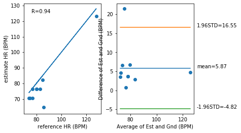  
> **R = 0.94, BIAS = 5.87, 95% limits of agreement(upper,lower) = 16.55,-4.82**   
> An *R* value close to `1` would mean that it is closely correlated (1 is perfectly correlated)  
> A *Bias* value of '5.87' means the estimate is biased to be around 5.87 off from the reference  
> The *upper,lower limits of agreements* show if there is an outlier that is outside of the 1.96 STD(95%) 

> Q. Sketch the correlation plot that would give you an R of 0. What does an R of 0 mean?  

> A.  
> **Plot:**  
> 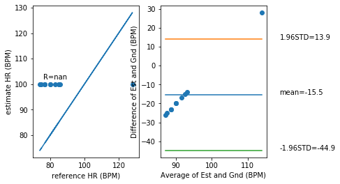  
> In this case, *R = 0* because no matter what the reference is, the estimate is always constant (100). This means that there is no correlation between the estimate and reference.

> Q. Sketch a scatter plot of the correlation and bland-altman plot if your estimation was perfect every time. What would be the R, RMSE, Bias, and STD value of a perfect estimator?

> A.  
> **Plot:**  
> 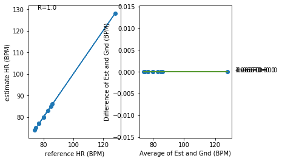  
> In this case, *R = 1* meaning that is perfectly correlated. The limits of agreements and Bias are 0 meaning that everything is no bias and everything is precise. 

> Q. How might we use the 1.96STD mark to assess if a given estimate might be an outlier?

> A.  The 1.98STD line marks the upper and lower limits of agreement. Anything outside of the 1.96STD lines means that the estimate is probably an outlier or does not correlate well to the rest of the estimates. 

> Q. What would your Bland-Altman plot look like if your algorithm always guessed 70BPM regardless of the actual heart rate? Describe some prominent features about the graph beyond just showing it.

> A.  
> 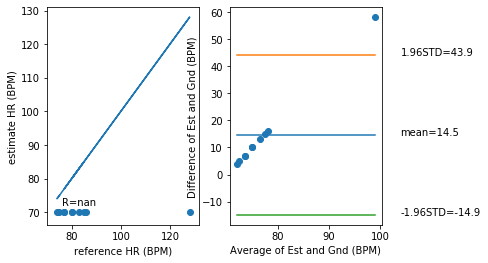  
> In this case, *R = 0* because the estimate is completely uncorrelated with the reference. Some prominent features in the bland-altman plot is that the points plotted is a straight line that can be represented by y=mx+b.

## Tutorial 2: Frequency Domain

> Q. If your sampling rate was 120Hz, what would be your maximum frequency (the Nyquist frequency)?

> A. 60 because Fs = 120, Half of the sampling frequency is 60hz which is the highest frequency component that is captured. 

> Q. If your signal bandwidth is composed of 0-10Hz, what is your minimum sampling rate to capture this signal based on the Nyquist sampling theorem? What would be recommended in general practice however?

> A. Based on the Nyquist sampling theorem, 20hz is the minimum nyquist rate because you would want to sample at 2x the highest frequency captured. However, 40hz (or 4x the max) is the practical recommended frequency. 

## Tutorial 3: Baseline DC Signal

> Q. How does your detrend function modify the frequency content of the signal? Show the plot and circle the part that is most modified and explain why.

> A. Detrending your signal removes the moving average from the signal. Without detrending, the moving average may be captured as the dominant frequency (often near the 0hz<1hz mark). This is why you see the high peak near the 0hz mark  below.  
> **Plot:**  
> 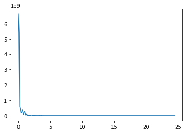  
> After detrending the signal (effectively removing the moving average), the frequency plot should look like this:  
>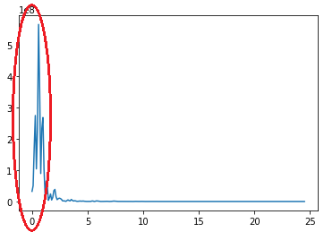   

## Tutorial 4: Dominant Frequency Component

> Q. Show the code - Use np.argmax to find the actual dominant frequency of the x acceleration (currently labeled as 1Hz in the above plot). The aim here is to use argmax to get the index of the maximum value of Pxx and then use that index to get the corresponding frequency in the Freqs array. Try this with and without removing the DC offset. What do you get?

> A. 
> **Code:**  
>  
>     import numpy as np
>     import matplotlib.pyplot as plt
>     from Libraries.HR import HR
>     from Libraries.Data import Data
>     
>     data_array = np.genfromtxt('data/appendix_a.csv', delimiter=',')#get data from >     Appendix A and save as .csv.
>     data = Data()
>     data.add_data(data_array)
>     print(data.get_num_samples())
>     
>     fs = int(data.calc_sampling_rate()) #sampling rate in Hz
>     t = (data_array[:,0] - data_array[0,0])/1e6#get the time array
>     s = data_array[:,1] #get the x-acceleration array
>     s = HR.detrend(s,fs)
>     
>     plt.clf()
>     plt.subplot(211)
>     plt.plot(t, s)
>     plt.subplot(212)
>     Pxx, Freqs = plt.psd(s, NFFT=len(t), Fs=fs) #plot the power spectral density
>     plt.show()
>     
>     plt.clf()
>     plt.plot(Freqs, Pxx)
>     plt.show()
>     
>     print(Freqs[np.argmax(Pxx)])
> **Plot w/ removing DC offset:**  
>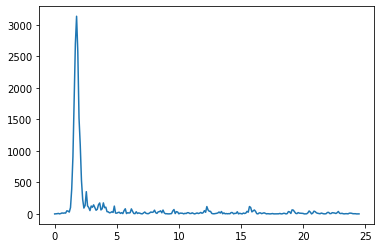  
> **Plot w/o removing DC offset:**  
>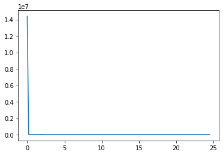  
> When we dont remove the DC offset using detrend, the dominant frequency is 0 because it captures the moving average. When we remove the DC offset, the actual dominant frequency is 1.764Hz shown by `print(Freqs[np.argmax(Pxx)])`

> Q. If we don’t remove the DC offset first, how can we index Pxx such that when we calculate argmax, we don’t look at the Pxx[0] (skipping the 0 index).

> A. We can add the following code (below) to the previous code (above) while removing the line `s=HR.detrend(s,fs)`
> **Code:**
> 
>     while np.argmax(Pxx) == 0:
>        Pxx = np.delete(Pxx, 0)
>        Freqs = np.delete(Freqs, 0)
>
>     plt.clf()
>     plt.plot(Freqs, Pxx)
>     plt.show()
> The code will detect the captured moving average (which is usually at the 0hz mark) and therefore effectively showing the actual dominant frequency

> Q. What is the dominant frequency for the y and z acceleration in the sample?

> A. domfreq of y = 1.764, domfreq of z = 1.96
> **Plots y-accel:**  
>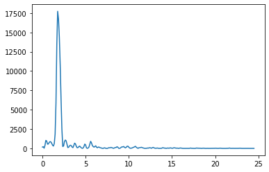  
> **Plots z-accel:**  
>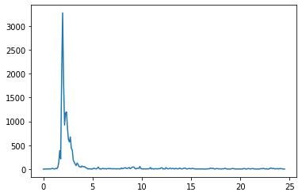  

## Challenge 1:

### Low Pass Filter 
**Code:**  

    filter_order = 3
    filter_cutoff = 5/(fs/2)
    b,a = signal.butter(filter_order, filter_cutoff, btype='lowpass')

    s_filt = signal.lfilter(b,a,s)
    w, h = signal.freqz(b,a)

**Plot:**  
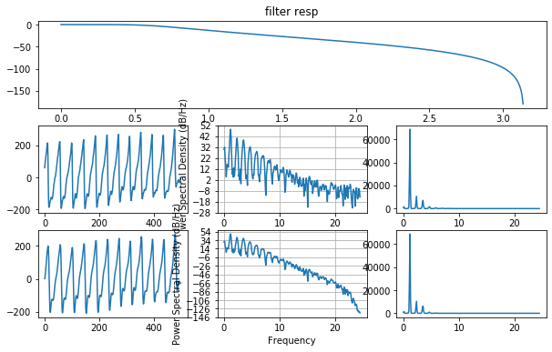

> Q. Looking at the documentation for signal.butter, how would you make a high pass filter with a cut off of 0.8Hz? Of the previous time based filters in Lab 4, which filter is most like the high pass filter?

> A.
> **Code:**  
>
>     filter_order = 3
>     filter_cutoff = 0.8
>     b,a = signal.butter(filter_order, filter_cutoff, btype='highpass')
>
>     s_filt = signal.lfilter(b,a,s)
>     w, h = signal.freqz(b,a)
>**Plot High Pass Filter:**  
> 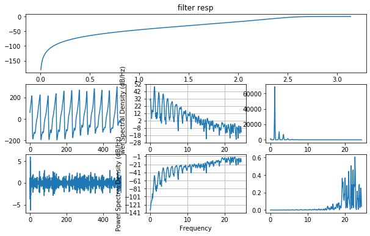
> Based on the previous time based filter, signal_diff() seems most like a high pass filter while moving_average() seemed most like a low pass. 

## Challenge 2: What is the Frequency Content of the PPG

**Plot:**    
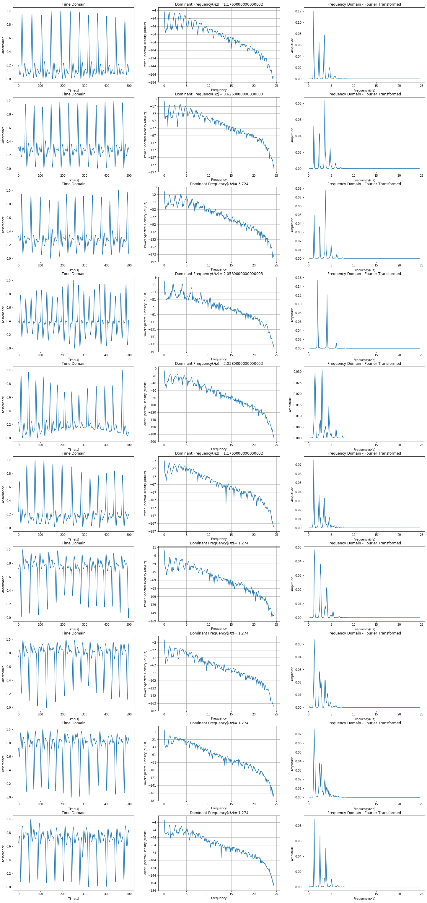  
***Note: dominant frequency titled in middle graph of each row*** 

> Q. How does the dominant frequency change with regards to the heart rate?

> A. The dominant frequency increases when heart rate increases.  
> `HeartRate(BPM) ÷ Dominant frequency(Hz) ≈ 60`
> The above equation shows that if the heartrate goes up, the dominant frequency must also go up to satisfy the equation. I derived this from noticing that the units of HR is `beats per minute` (beats per 60 seconds) and dominant frequency's units are `Hz` (beats per second). 

> Q. If the heart rate is 65BPM, what is approximately the fundamental frequency? What about the second and third harmonic? Why is it that even though the heart rate is 65BPM, there are higher frequency content than just the fundamental frequency? What does this imply about how you should be setting your sampling rate if you expect a heart rate maximum of 180BPM?

> A. Using the above equation, the approximate fundamental frequency for 65 BPM is `≈ 65/60 or 1.083Hz`.  The second and third harmonics are `≈ 1.08HZ*2 or 2.16Hz` and `1.08HZ*3 or 3.25Hz`. 

> A. Since a heart rate signal, it is not a perfect sinusoidal wave there will be other frequencies other than the fundamental frequency. These frequencies can be noise or other captured impurities like the moving average. Even with a noise-filtered and detrended signal, a heart rate signal is still triangular-like which could possibly require other harmonics to build the signal. 

> A. This might imply that for a Max HR of 180 BPM, we would only care about the dominant frequency which is 3Hz. According to the nyquist rate theory, the minimum sampling rate would be 6Hz, but in practice we would like to do at least 12Hz (4x the max)
 
## Challenge 3: Calculate Heart Rate with Frequency Domain Features

**Code:**  

    def calc_heart_rate_freq(signal,fs):
        signal = HR.preprocess(-signal, fs)
        Pxx, Freqs = plt.psd(signal, NFFT=500, Fs=fs)
        while np.argmax(Pxx) == 0:
            Pxx = np.delete(Pxx, 0)
            Freqs = np.delete(Freqs, 0)
        plt.clf()
        plt.plot(Freqs,Pxx)
        peaks,_= find_peaks(Pxx, height = 0.01)
        plt.plot(peaks/10,Pxx[peaks],'x')
        plt.show()
        print(Freqs[peaks])
        BPM = Freqs[peaks[0]]*60
        print(BPM)
        return BPM

> Q. What are some failure modes of your frequency domain solution?

> A. See next answer

> Q. Compare and contrast the two different algorithms. Which has a lower error? Which has a bias closer to 0? Do you see any signs of mean tracking in either algorithm? Use the correlation and difference plots to support your argument.

> A. The main problem would probably be having to preprocess and filter your signal for the best results. For most of my trials, the freq domain solution seemed more accurate with a closer to 1 R value and a closer to 0 Mean bias.  
> **Plot Frequency Domain Solution:**  
>  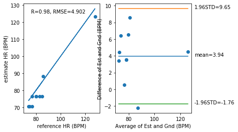  
> **Plot Time Domain Solution:**  
>     

## Part 2

## Tutorial 1: Collecting Data

* collected HR signals and reference readings from a separate HR sensor
* assured data was clean and usable for the ML portion

## Tutorial 2: List All Files in Directory

> Q. what is the correct regex to get trial “0” for any subject given our naming convention “ID_Trial_HR.csv”.

> A.  correct regex = `directory/name/data/*_01_*.csv`  
> I am assuming trial "0" is the first trial collected. 

## Tutorial 3: Manipulating Filenames

***Note: I noticed that the workflow for removing the directory path from the file name was easier with `import os`***

**Example Code Snippet using `os` module:**  

    import os
    import glob

    all_files = [os.path.basename(x) for x in glob.glob('data/data/training/*.csv')]
    print(all_files)
The above code should print the desired file names without the directory path
*Can be viewed in `src/Python/ML.py`*

## Challenge 4: Data for ML

**Code:**

    list_data = []
    list_sub = []
    list_ref = []
    list_trials = ['01', '02', '03', '04', '05', '06', '07', '08', '09', '10']

    for sub_id in unique_ids:#sub_id in the list of unique_ids
        sub_files = [os.path.basename(x) for x in glob.glob('data/data/training/'+str(sub_id)+'*.csv')]#using glob get the files of all files with this subject id
        for trial in range(len(sub_files)):#each file in the list of files for this subject
            file_name = [os.path.basename(x) for x in glob.glob('data/data/training/'+str(sub_id)+'_'+list_trials[trial]+'*.csv')]
            data = Data()
            try:
                data.add_data(np.genfromtxt('data/data/training/'+str(file_name[0]), delimiter=','))#read the csv
            except:
                break
                pass

            data.data_array = data.data_array[:500] # take the first 500

            fs = data.calc_sampling_rate()
            hr_data = data.data_array[:,4]#get the ppg signal from data using slicing
            hr_data = HR.preprocess(-hr_data,fs)#preprocess your hr_data:removing baseline, smooth your signal using a low pass filter and normalize. 
            list_data.append(hr_data)#append the preprocessed data to list_data
            file = [os.path.basename(x) for x in glob.glob('data/data/training/'+str(sub_id)+'_'+list_trials[trial]+'_*.csv')]#retrieve the reference heart rate from the filename.
            file=file[0]
            ref_hr = file[6:9]
            list_ref.append(ref_hr)#append the reference heart rate to list_ref
            list_sub.append(sub_id)#append the subject id to list_sub

    list_data = np.vstack(list_data)

> Q. According to the lecture, what is the recommended split between training and testing on a small dataset?

> A. According to the lecture, the recommended split `70% training/15% validation/15% testing` 

> Q. Why is it important to split on subjects and not to treat each file as an independent sample?

> A. For this lab, it is important to split on subjects rather than files because each subject's (person, in this case) HR sample are not equal because some people may have different types of HR signals.

### **Visual Documentation to prove that this part works**  
***Add this code (below) to the code (above) to output lists***

    print("\nunique ids:")
    print(unique_ids)
    print("\nlist_data")
    print(list_data)
    print("\nshape of list_data")
    print(np.shape(list_data))
    print("\nlist_sub")
    print(list_sub)
    print("\nlist_ref")
    print(list_ref)

**Output:**
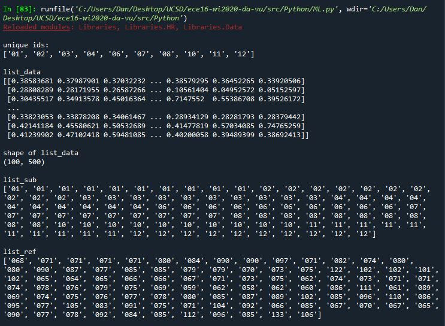  
***Text version:***  

    unique ids:
    ['01', '02', '03', '04', '06', '07', '08', '10', '11', '12']

    list_data
    [[0.38583681 0.37987901 0.37032232 ... 0.38579295 0.36452265 0.33920506]
    [0.28808289 0.28171955 0.26587266 ... 0.10561404 0.04952572 0.05152597]
    [0.30435517 0.34913578 0.45016364 ... 0.7147552  0.55386708 0.39526172]
    ...
    [0.33823053 0.33878208 0.34061467 ... 0.28934129 0.28281793 0.28379442]
    [0.42141184 0.45580621 0.50532689 ... 0.41477819 0.57034085 0.74765259]
    [0.41239902 0.47102418 0.59481085 ... 0.40200058 0.39489399 0.38692413]]

    shape of list_data
    (100, 500)

    list_sub
    ['01', '01', '01', '01', '01', '01', '01', '01', '01', '01', '02', '02', '02', '02', '02', '02', '02', '02', '02', '02', '03', '03', '03', '03', '03', '03', '03', '03', '03', '03', '04', '04', '04', '04', '04', '04', '04', '04', '04', '04', '06', '06', '06', '06', '06', '06', '06', '06', '06', '06', '07', '07', '07', '07', '07', '07', '07', '07', '07', '07', '08', '08', '08', '08', '08', '08', '08', '08', '08', '08', '10', '10', '10', '10', '10', '10', '10', '10', '10', '10', '11', '11', '11', '11', '11', '11', '11', '11', '11', '11', '12', '12', '12', '12', '12', '12', '12', '12', '12', '12']

    list_ref
    ['068', '071', '071', '071', '071', '080', '084', '090', '090', '097', '071', '082', '074', '080', '080', '090', '087', '077', '085', '085', '079', '079', '070', '073', '075', '122', '102', '102', '101', '102', '065', '064', '065', '066', '066', '067', '071', '073', '075', '062', '074', '073', '071', '071', '074', '078', '076', '079', '075', '069', '059', '062', '058', '062', '060', '086', '111', '061', '089', '069', '074', '075', '076', '077', '078', '080', '085', '087', '089', '102', '085', '096', '110', '086', '095', '077', '105', '083', '091', '075', '071', '104', '092', '066', '085', '067', '070', '067', '065', '090', '077', '078', '092', '084', '085', '112', '096', '085', '133', '106']

## Challenge 5: Gaussian Mixture Model for Heart Rate

> Q. What is the difference between leave-one-out validation and leave-one-subject-out validation? Which are we doing and why is this important, and why would it be an issue if we used the other validation method given what we are building?

> A. Both methods of validation are cross-validations but, in the case of `leave-one-out validation` we train all samples BUT one, and then cycle through the next sample, each time holding out a different sample while training the rest. In `leave-one-subject-out validation`, we group the data into N groups based on unique subjects and then hold out a unique subject each fold while training the rest; similarly cycling to the next unique subject each fold. For our lab, we are doing `leave-one-subject-out validation` because each unique subject's HR signal are not equal. This is important because we are training on a GMM model with 2-components (unique to different types of HR signals) and we also want to validate our algorithm on a unique dataset. Without doing this we might run into inconsistency errors in training from different HR signals. 

### **Documentation**

**Code:**  
*Note: I only use 30 Trials (3 subjects, 10 samples each) to speed up the training iteration*

    train_data = np.array([])#make empty numpy array of size 0
    hold_out_data = np.array([])#make empty numpy array of size 0

    print(" NOW TRAINING")

    for i in range(len(unique_ids[:])):
        train_ids=unique_ids[:]
        hold_out_subject = train_ids[i]
        for ind, sub_id in enumerate(list_sub):#enumerate the list_sub starting at 0. Look up enumerate function
            if sub_id != hold_out_subject:#sub_id is not the same as hold_out_subject) 
                train_data = np.concatenate((train_data, list_data[ind]))#concatenate numpy array train_data with the list_data at ind
            else:
                hold_out_data = np.concatenate((hold_out_data, list_data[ind]))#concatenate numpy array hold_out_data with list_data at ind
                
            try:
                gmm = GMM(n_components = 2).fit(train_data.reshape(-1,1))
            except:
                pass
            
    print(" DONE TRAINING")

**At this point, the GMM is done training all the train data as well as sorting out the hold-out data for validation**

    print("Shape of hold_out_data & elements of hold_out_data")
    print(np.shape(hold_out_data))
    print(hold_out_data)

**Output:**

    Shape of hold_out_data & elements of hold_out_data
    (15000,)
    [0.38583681 0.37987901 0.37032232 ... 0.40200058 0.39489399 0.38692413]

**Now, we will validate the hold-out data**  
*We validate it 500 samples at a time (equivalent to 1 trial)*

    list_bpm =[]
    for x in range(0,len(hold_out_data),500):
        trial = hold_out_data[x:x+500]
        fig = plt.gcf()
        fig.set_size_inches(8, 4)
        plt.clf()
        plt.subplot(121)
        plt.plot(trial)
        plt.title("\nPreprocessed heart signal\n Reference BPM=" +list_ref[int((x/500))])
        test_pred = gmm.predict(trial.reshape(-1,1))
    
        [BPM_Estimate, s_thresh_up] = HR.calc_heart_rate_time(test_pred,fs)
        plt.subplot(122)
        plt.plot(test_pred)
        plt.plot(s_thresh_up)
        plt.title("Threshold and prediction test\n Estimated BPM = "+str(BPM_Estimate))
        plt.show()
        list_bpm.append(BPM_Estimate) 

**After, each validation iteration, I plot the preprocessed HR signal & GMM predicted BPM estimate**  
*Example Plot:*  
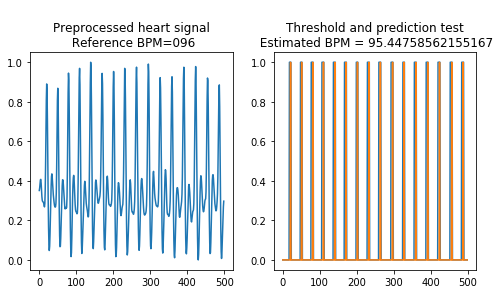  
*I only display (1) of the many plots to save space, each iteration will output a plot*

**Finally, I check to see how accurate the validation from the hold-out dataset was by using the RMSE & BlandAltmann Plots**

    print("List_bpm - Estimated BPM of validation sets from trained model") 
    print(list_bpm)

    int_ref=[]

    for ref in list_ref:
        ref = float(ref)
        int_ref.append(ref)

    ref_arr=np.array(int_ref)
    ref_array.astype(float)
    bpm_arr=np.array(list_bpm)

    ref_arr=np.reshape(int_ref,(len(int_ref),1))
    bpm_arr=np.reshape(list_bpm,(len(list_bpm),1))

    arrr = np.hstack((ref_arr,bpm_arr))
    arrr = np.reshape(arrr,(30,2))

    Visualize.plotBandAltmann(arrr)

**Plot:**  
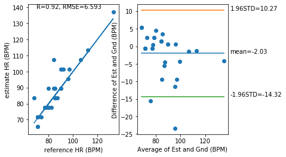  

## Challenge 6: OOP

### **OOP Code**

**Imported modules**

    import glob
    import os
    from Libraries.HR import HR
    from Libraries.Data import Data
    import matplotlib.pyplot as plt
    import numpy as np
    from sklearn.mixture import GaussianMixture as GMM

**ML class constructor:**

    def __init__(self):
            self.gmm = GMM(n_components = 2)
*Each instance of the ML class will have its own GMM*

**Code for train_hr_model(directory):**

    def train_hr_model(self, directory):
            print(directory)
            unique_ids = []
            # all_files = [os.path.basename(x) for x in glob.glob('data/data/training/*.csv')]
            all_files = [os.path.basename(x) for x in glob.glob(directory+'*.csv')]
            
            for file in all_files:
                sub_id = file[:2]
                if sub_id not in unique_ids:
                    unique_ids.append(sub_id)
            print(unique_ids)
            
            list_data = []
            list_sub = []
            list_ref = []
            list_trials = ['01', '02', '03', '04', '05', '06', '07', '08', '09', '10']
            
            for sub_id in unique_ids:#sub_id in the list of unique_ids
                sub_files = [os.path.basename(x) for x in glob.glob(directory+str(sub_id)+'*.csv')]#using glob get the files of all files with this subject id
                for trial in range(len(sub_files)):#each file in the list of files for this subject
                    file_name = [os.path.basename(x) for x in glob.glob(directory+str(sub_id)+'_'+list_trials[trial]+'*.csv')]
                    data = Data()
                    try:
                        data.add_data(np.genfromtxt(directory+str(file_name[0]), delimiter=','))#read the csv
                    except:
                        break
                        pass
                    data.data_array = data.data_array[:500]
                    fs = data.calc_sampling_rate()
                    hr_data = data.data_array[:,4]#get the ppg signal from data using slicing
                    hr_data = HR.preprocess(-hr_data,fs)#preprocess your hr_data:removing baseline, smooth your signal using a low pass filter and normalize. 
                    list_data.append(hr_data)
                    file = [os.path.basename(x) for x in glob.glob(directory+str(sub_id)+'_'+list_trials[trial]+'_*.csv')]
                    file=file[0]
                    ref_hr = file[6:9]
                    list_ref.append(ref_hr)
                    list_sub.append(sub_id)
                    
            list_data = np.vstack(list_data)
            print(list_data)
            print(np.shape(list_data))
            print(list_sub)
            print(list_ref)
            
            train_data = np.array([])#make empty numpy array of size 0
            hold_out_data = np.array([])#make empty numpy array of size 0

            print(" NOW TRAINING")

            for i in range(len(unique_ids[:])):
                train_ids=unique_ids[:]
                hold_out_subject = train_ids[i]
                for ind, sub_id in enumerate(list_sub):#enumerate the list_sub starting at 0. Look up enumerate function
                    if sub_id != hold_out_subject:#sub_id is not the same as hold_out_subject) 
                        train_data = np.concatenate((train_data, list_data[ind]))#concatenate numpy array train_data with the list_data at ind
                    else:
                        hold_out_data = np.concatenate((hold_out_data, list_data[ind]))#concatenate numpy array hold_out_data with list_data at ind
                        
                    try:
                        self.gmm = GMM(n_components = 2).fit(train_data.reshape(-1,1))
                    except:
                        pass
            
            print(" DONE TRAINING")
            
            print("\nShape of hold_out_data & elements of hold_out_data")
            print(np.shape(hold_out_data))
            print(hold_out_data)

            list_bpm =[]
            for x in range(0,len(hold_out_data),500):
                trial = hold_out_data[x:x+500]
                fig = plt.gcf()
                fig.set_size_inches(8, 4)
                plt.clf()
                plt.subplot(121)
                plt.plot(trial)
                # plt.title("\nPreprocessed heart signal\n Trial #=" +str(int((x/500)+1)))
                plt.title("\nPreprocessed heart signal\n Reference BPM=" +list_ref[int((x/500))])
                test_pred = self.gmm.predict(trial.reshape(-1,1))
            
                [BPM_Estimate, s_thresh_up] = HR.calc_heart_rate_time(test_pred,fs)
                plt.subplot(122)
                plt.plot(test_pred)
                plt.plot(s_thresh_up)
                plt.title("\nThreshold and prediction test\n Estimated BPM = "+str(BPM_Estimate))
                plt.show()
                list_bpm.append(BPM_Estimate) 

            print("\nList_bpm - Estimated BPM of validation sets from trained model") 
            print(list_bpm)

            int_ref=[]
            
            for ref in list_ref:
                ref = float(ref)
                int_ref.append(ref)
            
            ref_arr=np.array(int_ref)
            print(ref_arr)
            bpm_arr=np.array(list_bpm)
            
            ref_arr=np.reshape(int_ref,(len(int_ref),1))
            bpm_arr=np.reshape(list_bpm,(len(list_bpm),1))
            
            arrr = np.hstack((ref_arr,bpm_arr))
            arrr = np.reshape(arrr,(30,2))
            
            Visualize.plotBandAltmann(arrr)

*The code displayed above is mostly a replication of the code displayed and explained in Challenge 5. The main difference is that `gmm` before is now `self.gmm` because in OOP each ML instance will have its own model. For the sake of brevity, I will not re-explain it here*

**Code for calc_hr(s,fs):**

    def calc_hr(self,s,fs):
            fig = plt.gcf()
            fig.set_size_inches(12, 4)
            plt.clf()
            plt.subplot(131)
            plt.plot(s.data_array[:,4])
            plt.title("Original HR signal")
            
            shr = s.data_array[:,4]
            shr = HR.preprocess(-shr, fs)
            plt.subplot(132)
            plt.plot(shr)
            plt.title("Preprocessed HR signal")
        
            test_pred = self.gmm.predict(shr.reshape(-1,1))
            ##fixy
            unique,counts=np.unique(test_pred, return_counts=True)
            # print(unique,counts)
            if counts[0] < counts[1]:
                # print("flip time")
                test_pred = -test_pred + 1
            ##fixy
            [BPM_Estimate, s_thresh_up] = HR.calc_heart_rate_time(test_pred,fs)
            plt.subplot(133)
            plt.plot(test_pred)
            plt.plot(s_thresh_up)
            plt.title("Estimated BPM according to GMM")
            plt.show()
            print("Estimated BPM = "+str(BPM_Estimate))  
            return BPM_Estimate
*The code above takes a raw signal and a sampling rate to calculate an estimated BPM based on its trained GMM*  
* It plots the raw signal, the preprocessed signal, and the GMM prediction 
* The code in-between the `fixy` comments fixes the test prediction due to an random error I noticed while iterating tests. I might explain it as part of the grand challenge (as a plus)
* It also prints and returns the BPM estimate
**Example Plot:**
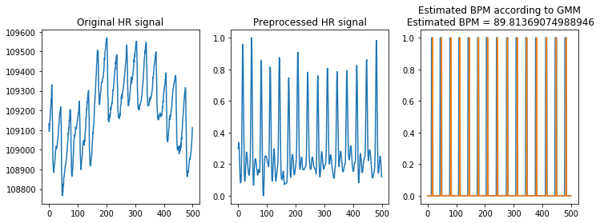 

**Code for test_hr_model(directory):**

    def test_hr_model(self,directory):
            unique_ids = []
            unique_trial = []
            ref_hr = []
            esthr=[]
            arr=np.array([])
            all_files = [os.path.basename(x) for x in glob.glob(directory+'*.csv')]
            
            for file in all_files:
                sub_id = file[:2]
                if sub_id not in unique_ids:
                    unique_ids.append(sub_id)
                    
            print(unique_ids)
            for file in all_files:
                trial = file[3:5]
                if trial not in unique_trial:
                    unique_trial.append(trial)
                    
            for file in all_files:
                heartbeat = file[6:9]
                ref_hr.append(heartbeat)
            
            i=0
            for num in range(len(unique_ids)):
                for trial in range(len(unique_trial)):
                    file_name = str(unique_ids[num])+'_'+str(unique_trial[trial])+'_'+str(ref_hr[i]+'.csv')
                    print(file_name)
                    raw_data=np.genfromtxt(directory+file_name, delimiter=',')
                    raw_data=raw_data[:500]
                    raw_data_obj = Data()
                    raw_data_obj.add_data(raw_data)
                    fs = raw_data_obj.calc_sampling_rate()
                    i=i+1
                    esthr.append(self.calc_hr(raw_data_obj, fs))
                    
            ref_hr = []
            for file in all_files:
                heartbeat = float(file[6:9])
                ref_hr.append(heartbeat)
            
            ref_arr=np.array(ref_hr)    
            est_arr=np.array(esthr)  
        
            ref_arr=np.reshape(ref_arr,(ref_arr.size,1))
            est_arr=np.reshape(est_arr,(est_arr.size,1))
        
            arr = np.hstack((ref_arr,est_arr))
            arr= np.reshape(arr,(10,2))
            
            print(np.shape(arr))
            Visualize.plotBandAltmann(arr)
            
            return arr

*The code above will accept a given directory and use the files in that directory to test and calculate the estimated HR BPM for each trial*  
* It will parse the raw data to collect the desired HR signal
* It will also parse the file name to get the `subject ID/trial number/Reference HR`
* It will then call ML.calc_hr(signal,fs) to calculate the heart rate for each trial
    * This will effectively also plot the raw signal, preprocessed signal, and estimated GMM as described in calc_hr (above)
* Finally, it will store the reference HR and estimated HR into a 2 column array and then plot the RMSE and Bland-Altmann plots so we can analyze its performance
* It was also return this 2 column array  
**RMSE and Bland-Altmann Plots for performance analysis:**
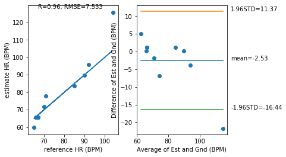  
*This is the performance analysis plot for `Subject_ID = 11`. As we can see the GMM's prediction is mostly well correlated with a close to 1 R-value(0.96) and a relatively close to 0 mean-bias value. One of the trial estimates were an outlier as seen in the Bland-Altmann plot since it is below the lower limit of agreement. The accuracy RMSE value is 7.533 a little high but probably because of the outlier.  

**Code to call the functions above:**

    ml = ML()
    ml.train_hr_model('data/data/TRASH/')
    ml.test_hr_model('data/data/testing/')
*This code may seem trivial but to explain my understanding of OOP, the above code creates an instance of the ML class and then calls its methods to train a GMM and then test it on a dataset.*

### **End of Report**

### *Notes:*
* the directory `/data/data/TRASH/` is the directory in which I use to train the GMM in this report. There is less files/trials here in order to speed of the iteration process of the training. From my test runs, a lower amount of training did not affect the performance of the GMM predictions that much, possible because the prediction task is quite simple. 
* The reason I did not include gifs is because I did not think it could capture and document my understanding of the lab objectives well. Although gifs are really good at showing that hardware runs and works, and perhaps showing that code runs, I did not think that it would be needed in this lab due to the absence of hardware involvement.  
